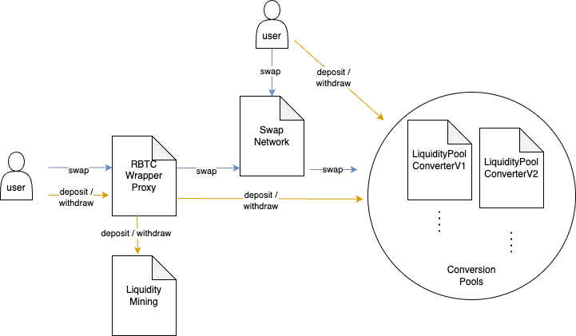

# AMM

<figure><figcaption>
Actions on the AMM
</figcaption></figure>

The user interacts mainly with two types of contracts on the AMM:

* LiquidityPoolConverter : Manages user-owned liquidity used for swaps,&#x20;
* SwapNetwork : Offers swaps on one or more converters.

In addition there is a helper contract, called RBTCWrapperProxy, which serves two purposes:

* Automatic wrapping and unwrapping of (W)RBTC,
* Automatic deposits to / withdrawals from the liquidity mining contract.

All contracts with exception of the liquidity mining contract can be found here: [https://github.com/DistributedCollective/oracle-based-amm](https://github.com/DistributedCollective/oracle-based-amm) .

This builder portal focused on the most relevant functionality. A complete documentation of all contracts belonging to the AMM can be found here: [https://github.com/DistributedCollective/oracle-based-amm/tree/development/docs](https://github.com/DistributedCollective/oracle-based-amm/tree/development/docs) .

