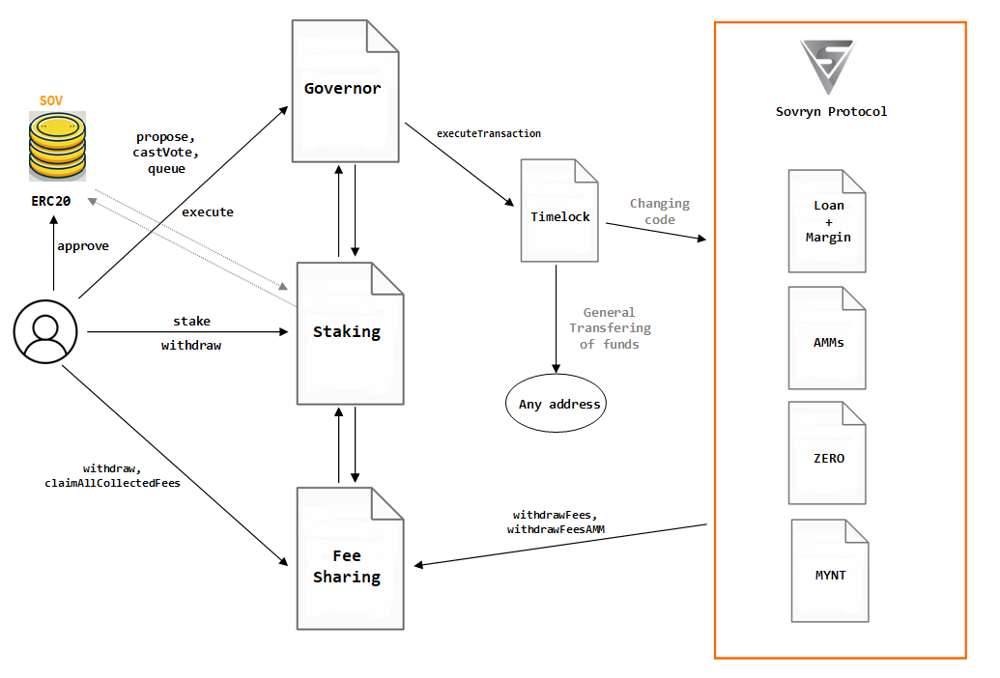

# BITOCRACY

<figure><figcaption>
Sovryn's Bitocracy
</figcaption></figure>

Bitocracy is based on three basic modules: Staking, Governance and Fee Sharing modules. When a user acquires some SOV asset they are able to put it in a stake position. The position value depends on the time the asset is committed, and the relation between time, asset amount and value is close to - when not exactly - a quadratic function.

**Staking**: For this, the user needs to `approve` the handling of the SOV asset to the Staking contract, and then call `Staking.stake`. This action makes the user into a "staker".

**Governor**: Having a staking position allows the user to vote for a proposal (`castVote`), and under certain conditions - having a net 1% of current total voting power in all their staking positions - to make a proposal (`propose`). If a proposal reaches enough votes in favor - the status of the proposal is "succeeded" - anybody can call the function `Governor.queue`, which prepares the proposal to be executed; and after a `delay` time window - which is 48 hours for the `GovernorOwner` and `TimelockOwner`, and 24 hours for `GovernorAdmin` and `TimelockAdmin` - anybody can call the function `Governor.execute`.

The difference between the `GovernorOwner` instance of `GovernorAlpha` - or, just `Governor` - and `GovernorAdmin` is the capabilities to execute the actions of a proposal. The "owner" version is destined to any change of code on the whole Sovryn protocol, while the "admin" version is destined to the manage of funds.

**Timelock**: This contract filters if a set of actions coming from a proposal have the enough clearance to be executed. Only the `Governor` can call `Timelock.executeTransaction`, and only `Timelock` has the authority to perform changes on Sovryn's code and manage some funds from certain pools.

**Fee Sharing**: The contract `FeeSharingCollector` rewards with revenues and profits coming from the fees collected in the Sovrn protocol to all stakers. As the `Governor` contract, the `FeeSharingCollector` makes internal calls to the `Staking` contract to be able to estimate the proper amount of funds a staker, based on a parameter from which the proper share of fees is calculated. In the case of the `Governor`, it allows to estimate the voting power, by the moment of casting a vote.

**Vesting**: Not shown in the former diagram, the `Vesting` sub-set of the staking protocol, is a method to reward users, Sovryn's core team and other contributors that participate in several programs that community regards valuable. But instead of rewarding these people with liquid SOV assets, the SOV is delivered under a "vesting" schedule.

## 1. [Staking](staking.md)

The staking contract involde a set of modules linked to proxies through the [ModulesProxy](https://github.com/DistributedCollective/Sovryn-smart-contracts/blob/7196ecbc4c20a7d215ab0eb1539d44d68a686020/contracts/proxy/modules/Readme.md) implementation.

The StakingModuleProxy contract (named `ModulesProxy`) is itself a logic for the `StakingProxy` contract because its the storage is used.  

Therefore the current Staking functions call flow as follow:   

    StakingProxy --delegatecall--> StakingModulesProxy --delegatecall--> <Staking-Module-Contract>.<function selector>

The most common functions to call staking are `staking.stake` and `staking.withdraw`.

## 2. [Governor](governor.md)

The `GovernorAlpha` contracts and its instances: `GovernorOwner` and `GovernorAdmin` are in the core of the Bitocracy mechanics. Through a set of proposals, and voting on them, Sovryn's community decides how the protocol evolves and funds should be assigned.

The most common function to call are `GovernorAlpha.propose`, `GovernorAlpha.castVote`, `GovernorAlpha.queue` and `GovernorAlpha.execute`.

## 3. [Fee Sharing Collector](feeSharing.md)

It's a fee distributor among stakers, and according the weight of their stakes. This weight changes through time, and that's why the calculation method of claimable fees depends on predetermined "checkpoints" in time. This makes claim transactions heavy, and the [withdraw function](https://wiki.sovryn.com/en/technical-documents/FeeSharingContract#users-withdrawal) had to be completed with an adittional helper function.

The most common function to call are `FeeSharingCollector.withdraw` and `FeeSharingCollector.claimAllCollectedFees`.

## 4. [Vesting](vesting.md)

Vesting contracts are created through `VestingRegistry.createVestingAddr`. The entities authorized to execute this action are the `TimelockOwner` or any of the admins delegated by the exchequer.

