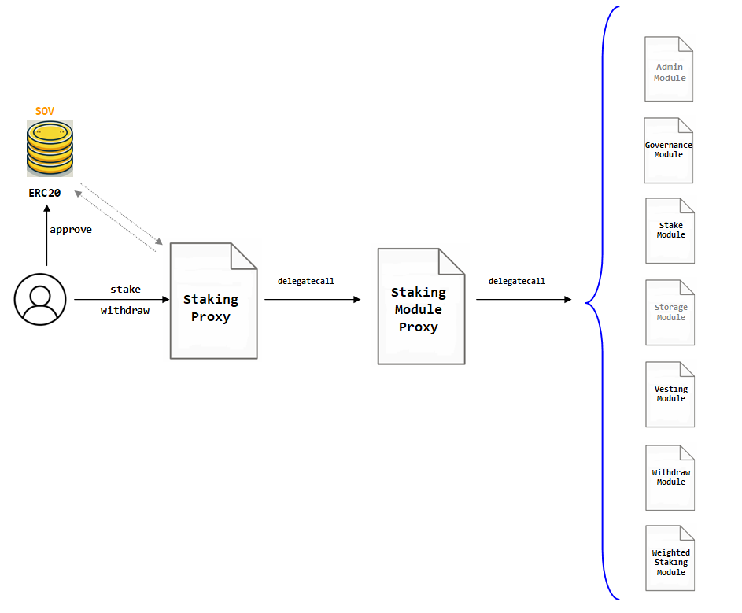

# STAKING CONTRACT

Staking contract allows SOV owners to put their assets in a locked position, commiTted until a given date. In exchange the user receives rights in the voting system (the `GovernorAlpha` contract) and in the fee sharing contract rewarding them with a cut of the fees collected by the Sovryn protocol. This whole system - staking, governance and fee sharing - is known as "Bitocracy".

<figure><figcaption><p>Smart Contract Structure for Staking Contract</p></figcaption></figure>

## STAKING CONTRACT STRUCTURE

Staking contract is an upgradeable contract deployed with a specific strategy to save the most amount of bytecode per module. As shown in the figure, the logics of the `Staking` contract is distributed in seven modules as described below:

* **Admin Module**: Is the access and control layer. It allows to set logics and parameters for the protocol. Its functions are accessible only by the `Timelock` itself or other designated administrators by the protocol.  
* **Governance Module**: Is a calculator for voting power of users and delegates.  
* **Stake Module**: The logics that governs the managing of staking positions.  
* **Storage Module**: The logics that manages the way the proxy's storage is used.  
* **Vesting Module**: The logics governing the way the staking positions for vesting contracts are created and tracked.  
* **Withdraw Module**: Special logics ruling the way assets are withdrawn from staking.  
* **Weighted Staking Module**: Is a complementary calculator for the weights of a staking position, required for the voting power and to determine the amount of profits claimable for the user.  


## STAKING ASSETS

In order to open a staking position, the user must own a balance of valid assets:`SOV` so far.

The user must first execute the proper `approve` function to the ERC20 contract of `SOV`.

After such transaction the user can address the execution of `stake` to the `Staking` contract. The `stake` function implies the internal execution of several `delegatecall`s to the `StakingModuleProxy` and several of logic modules.

```solidity
function stake(
        uint96 amount,
        uint256 until,
        address stakeFor,
        address delegatee
    ) external whenNotPaused whenNotFrozen 
```

**Arguments**

<table><thead><tr><th width="200.33333333333334">Name</th><th width="165">Type</th><th>Description</th></tr></thead><tbody><tr><td>amount</td><td>uint96</td><td>The number of SOV tokens to stake</td></tr><tr><td>until</td><td>uint256</td><td>Timestamp in seconds<br> -blockchain format-<br> indicating the date until which to stake</td></tr><tr><td>stakeFor</td><td>address</td><td>The address to stake the tokens for or zero address if staking for oneself</td></tr><tr><td>delegatee</td><td>address</td><td>The address of the delegatee or zero address if there is none.</td></tr></tbody></table>

## UNSTAKING ASSETS

If a user had or still have a staking position can perform call the function `withdraw` to the `Staking` contract. Early unstaking will be punished. The current destin of punished SOV is the zero address (they are burned).

```solidity
function withdraw(
  uint96 amount, 
  uint256 until, 
  address receiver) external whenNotFrozen 
```

**Arguments**

<table><thead><tr><th width="200.33333333333334">Name</th><th width="165">Type</th><th>Description</th></tr></thead><tbody><tr><td>amount</td><td>uint96</td><td>The number of SOV tokens to stake</td></tr><tr><td>until</td><td>uint256</td><td>Timestamp in seconds<br> -blockchain format-<br> indicating the date until which to stake<br><br>If until is not a valid "unlock" date, the next lock date after until is used.</td></tr><tr><td>receiver</td><td>address</td><td>The receiver of the tokens. If not specified, send to the msg.sender</td></tr></tbody></table>

