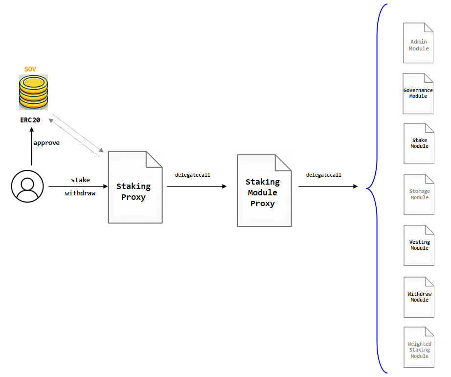

# STAKING CONTRACT

<figure><figcaption><p>Smart Contract Structure for Staking Contract</p></figcaption></figure>

## STAKING CONTRACT STRUCTURE

Staking contract is an upgradeable contract deployed with a specific strategy to save the most amount of bytecode per module. As shown in the figure, the logics of the `Staking` contract is distributed in seven modules as described below:

* Admin Module: .  
* Admin Module: .  
* Admin Module: .  
* Admin Module: .  
* Admin Module: .  
* Admin Module: .  
* Admin Module: .  

After such transaction the user can address the execution of `mintTo` to the `MassetManager` contract. The `mintTo` function implies the internal execution of `safeTransferFrom` openzeppeling tool to bring the basic asset to the treasury of `MassetManager` and then the execution of `DLLR.mint` in favor of the user.


## STAKING ASSETS

In order to perform the minting of DLLR assets, the user must own a balance of valid assets: so far, whether Dolar-on-Chain or "DOC" or Zero-Dollar or "ZUSD".

The user must first execute the proper `approve` function to the ERC20 contract of the basic asset.

After such transaction the user can address the execution of `mintTo` to the `MassetManager` contract. The `mintTo` function implies the internal execution of `safeTransferFrom` openzeppeling tool to bring the basic asset to the treasury of `MassetManager` and then the execution of `DLLR.mint` in favor of the user.

```solidity
function mintTo(
        address _bAsset,
        uint256 _bAssetQuantity,
        address _recipient
    ) external nonReentrant returns (uint256 massetMinted) 
```

**Arguments**

<table><thead><tr><th width="200.33333333333334">Name</th><th width="165">Type</th><th>Description</th></tr></thead><tbody><tr><td>_bAsset</td><td>address</td><td>Address of the Basic Asset<br>.</td></tr><tr><td>_bAssetQuantity</td><td>uint256</td><td>Quantity in Basic - Asset units</td></tr><tr><td>_recipient</td><td>address</td><td>Receipient of the newly minted mAsset tokens</td></tr><tr><td>massetMinted</td><td>uint256</td><td>Number of newly minted mAssets</td></tr></tbody></table>

## UNSTAKING ASSETS

In order to perform the minting of DLLR assets, the user must own a balance of valid assets: so far, whether Dolar-on-Chain or "DOC" or Zero-Dollar or "ZUSD".

The user must first execute the proper `approve` function to the ERC20 contract of the basic asset.

After such transaction the user can address the execution of `mintTo` to the `MassetManager` contract. The `mintTo` function implies the internal execution of `safeTransferFrom` openzeppeling tool to bring the basic asset to the treasury of `MassetManager` and then the execution of `DLLR.mint` in favor of the user.

```solidity
function mintTo(
        address _bAsset,
        uint256 _bAssetQuantity,
        address _recipient
    ) external nonReentrant returns (uint256 massetMinted) 
```

**Arguments**

<table><thead><tr><th width="200.33333333333334">Name</th><th width="165">Type</th><th>Description</th></tr></thead><tbody><tr><td>_bAsset</td><td>address</td><td>Address of the Basic Asset<br>.</td></tr><tr><td>_bAssetQuantity</td><td>uint256</td><td>Quantity in Basic - Asset units</td></tr><tr><td>_recipient</td><td>address</td><td>Receipient of the newly minted mAsset tokens</td></tr><tr><td>massetMinted</td><td>uint256</td><td>Number of newly minted mAssets</td></tr></tbody></table>

