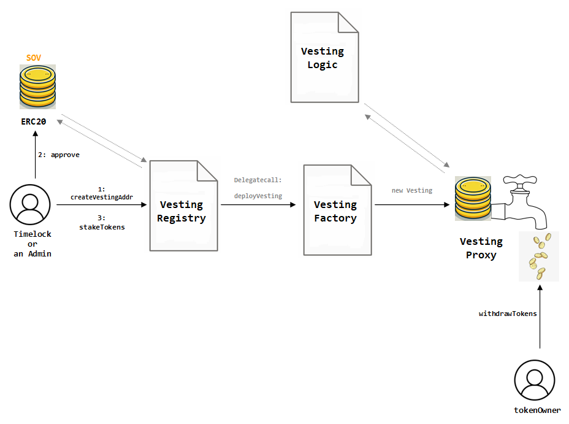

# VESTING CONTRACTS

Vesting contracts allows contributors and users that participate in certain programs like farming, to earn SOV assets in a programmed way, avoiding a negative impact in the circulating supply economy of the token -or tokenomics-.

<figure><figcaption><p>Vesting Contracts Protocol</p></figcaption></figure>

## VESTING CONTRACTS PURPOSE

Vesting contracts allows distribute rewards in a time windows minimizing the impact of additional available liquidity to the SOV price. Vesting contract owners, or `tokenOwner`s are awarded with voting power, but not with claiming rights to the fee sharing contract.

Stakings must be "voluntary" or non related to vestings in order to qualify to rewards from fee distributions.


## VESTING CREATION

Vestings can only be created by `TimelockOwner` contract (by the means of a proposal through `GovernorOwner` and **NOT** `GovernorAdmin`) or the admins designated by a former SIP.

The first step is the creation of the vesting contract through the call `VestingRegistry.createVestingAddr`.

```solidity
function createVestingAddr(
        address _tokenOwner,
        uint256 _amount,
        uint256 _cliff,
        uint256 _duration,
        uint256 _vestingCreationType
    ) public onlyAuthorized
```

**Arguments**

<table><thead><tr><th width="200.33333333333334">Name</th><th width="165">Type</th><th>Description</th></tr></thead><tbody><tr><td>_tokenOwner</td><td>address</td><td>the future owner of the vested assets<br>.</td></tr><tr><td>_amount</td><td>uint256</td><td>the net amount to be staked<br> -blockchain format-<br> indicating the date until which to stake</td></tr><tr><td>_cliff</td><td>uint256</td><td>the cliff time window in seconds<br>.</td></tr><tr><td>_duration</td><td>uint256</td><td>the total duration of the vesting in seconds</td></tr><tr><td>_vestingCreationType</td><td>uint256</td><td>the type of vesting contracts to be created(e.g. Origin, Bug Bounty etc.)</td></tr></tbody></table>

## VESTING FUNDING

Once the vesting has been created, the admin must first `approve` the handling of the SOV assets to `VestingRegistry`. Then the funds can be staked through: `VestingRegistry.stakeTokens`.

```solidity
function stakeTokens(address _vesting, uint256 _amount) external onlyAuthorized 
```

**Arguments**

<table><thead><tr><th width="200.33333333333334">Name</th><th width="165">Type</th><th>Description</th></tr></thead><tbody><tr><td>_vesting</td><td>address</td><td>the address of Vesting contract</td></tr><tr><td>_amount</td><td>uint256</td><td>the amount of tokens to stake</td></tr></tbody></table>

## VESTING WITHDRAWALS

By default, the staked assets are released to the `tokenOwner` each two periods of unlock staking checkpoints. When the `tokenOwner` has available assets to withdraw, they can perform `Vesting.withdrawTokens` where "Vesting" is the instance of the vesting contract specially created for this user.

```solidity
function withdrawTokens(address receiver) public onlyOwners 
```

**Arguments**

<table><thead><tr><th width="200.33333333333334">Name</th><th width="165">Type</th><th>Description</th></tr></thead><tbody><tr><td>receiver</td><td>address</td><td>The receiving address</td></tr></tbody></table>
