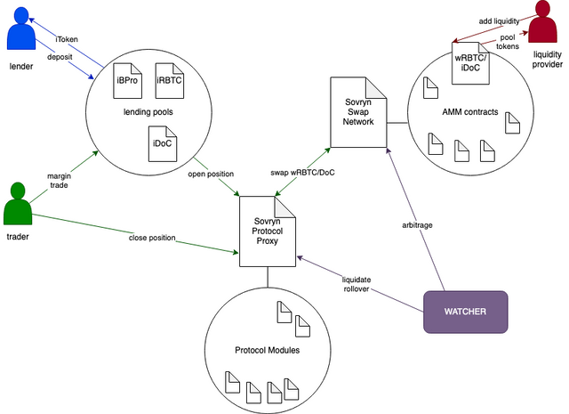

# Sovryn Protocol

<figure><figcaption>
The Sovryn Protocol and its connection to other parts of the system.
</figcaption></figure>

The user interacts with the loan token contracts (aka lending pools) in order to borrow or margin trade. The lending pools provide the loan and open a position on the Sovryn Protocol. The Sovryn Protocol is responsible for holding the collateral and swap between the collateral and loan currency on the AMM. It also provides the interface to modify existing positions.&#x20;

The source code resides in our [github](https://github.com/DistributedCollective/Sovryn-smart-contracts/).

This builder portal focuses on the most relevant functionality. A complete documentation of all contracts and their functions can be found [here](https://github.com/DistributedCollective/Sovryn-smart-contracts/tree/development/docs).&#x20;
