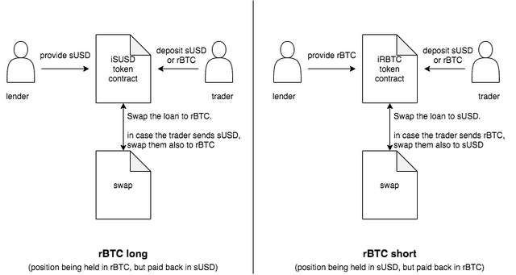

# Margin Trading

In order to enter a trade, call `marginTrade` on the respective iToken contract. Let's say you want to trade RBTC against XUSD. You enter a BTC long position by sending either of these currencies to the iXUSD contract and a short position by sending either of them to the iRBTC contract. The process is depicted below.

<figure><figcaption>
How to open long or short positions.
</figcaption></figure>
