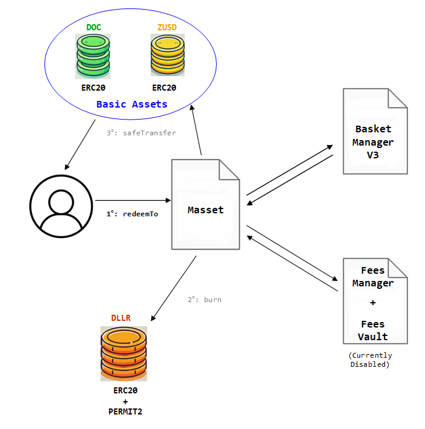

# MASSET TO BASSET CONVERSION

<figure><figcaption><p>Conversion of DLLR into Basic Assets</p></figcaption></figure>


## Redeeming DLLR stable coin

The user can directly redeem their "DLLR" assets into any of the basic assets available in the balance of the Masset treasury.

The user can address the execution of `redeemTo` to the `MassetManager` contract. The `DLLR.burn` internal operation can only be executed by the `Massetmanager` contract, and then the `safeTransfer` openzeppeling tool function will be executed to send the basic asset i favor of the user.

```solidity
function redeemTo(
        address _bAsset,
        uint256 _massetQuantity,
        address _recipient
    ) external nonReentrant returns (uint256 massetRedeemed) 
```

**Arguments**

<table><thead><tr><th width="200.33333333333334">Name</th><th width="165">Type</th><th>Description</th></tr></thead><tbody><tr><td>_bAsset</td><td>address</td><td>Address of the Basic Asset to redeem.<br>.</td></tr><tr><td>_massetQuantity</td><td>uint256</td><td>Units of the masset to redeem<br>.</td></tr><tr><td>_recipient</td><td>address</td><td>Address to credit with withdrawn Basic Assets<br>.</td></tr><tr><td>massetRedeemed</td><td>uint256</td><td>Relative number of mAsset units burned to pay for the Basic Assets.</td></tr></tbody></table>

