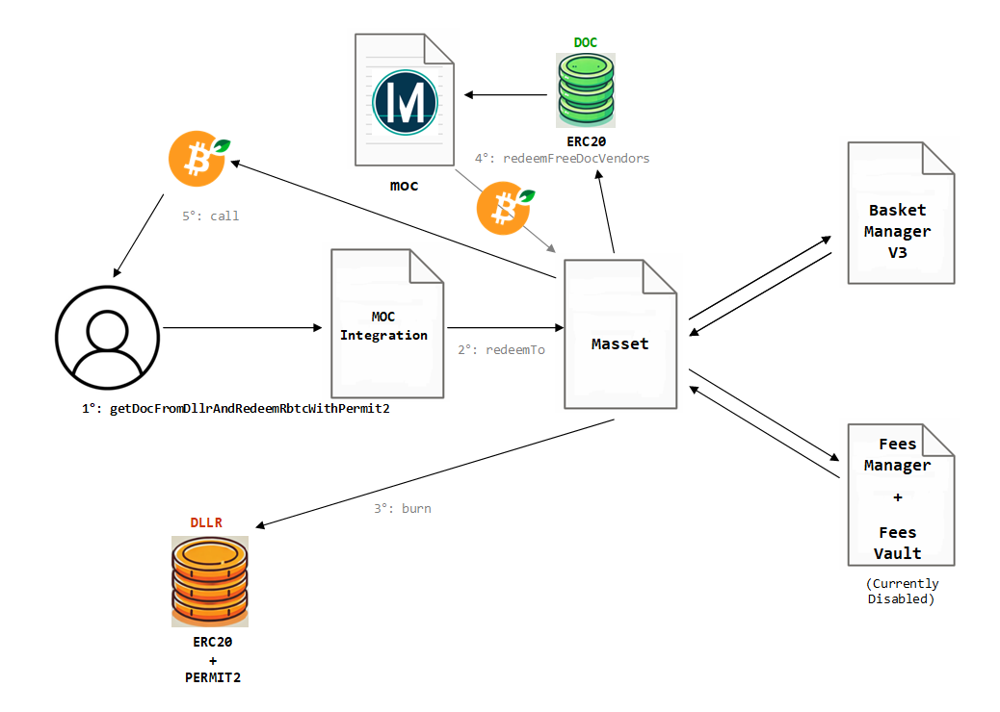

# MOC INTEGRATION

<figure><figcaption><p>Conversion of DLLR into rBTC via Money on Chain Integrator</p></figcaption></figure>


## Redeeming DLLR into rBTC via Money on Chain Integrator Contract

The redemption of DLLR asset into native asset in RSK, is intrincate, but mainly implies the `DLLR.burn` of meta-asset token, and then the conversion of available DOC tokens into rBTC using MOC protocol in favour of Masset contract and then sending these rBTC to the user.

```solidity
function getDocFromDllrAndRedeemRbtcWithPermit2(
        ISignatureTransfer.PermitTransferFrom memory permit,
        bytes memory signature
    ) external 
```

**Arguments**

<table><thead><tr><th width="200.33333333333334">Name</th><th width="165">Type</th><th>Description</th></tr></thead><tbody><tr><td>permit</td><td>PermitTransferFrom struct</td><td>data containing the specifications of the conversion</td></tr><tr><td>signature</td><td>permit standard struct data</td><td>the signature that authorizes the conversion</td></tr></tbody></table>

