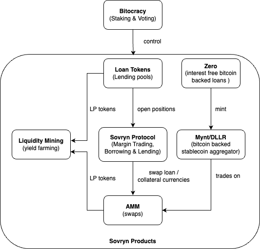

# Overview

<figure><figcaption></figcaption></figure>

The Sovryn product suite consists of following interconnected components:

* Bitocracy: Staking & Voting
* Loan tokens: Lending, Borrowing, Margin Trading
* Sovryn Protocol: Open, close and maintain positions
* Zero: Interest-free bitcoin backed loans
* Mynt/DLLR: Bitcoin backed stablecoin aggregator
* AMM: Swaps
* Liquidity Mining: Yield Farming

